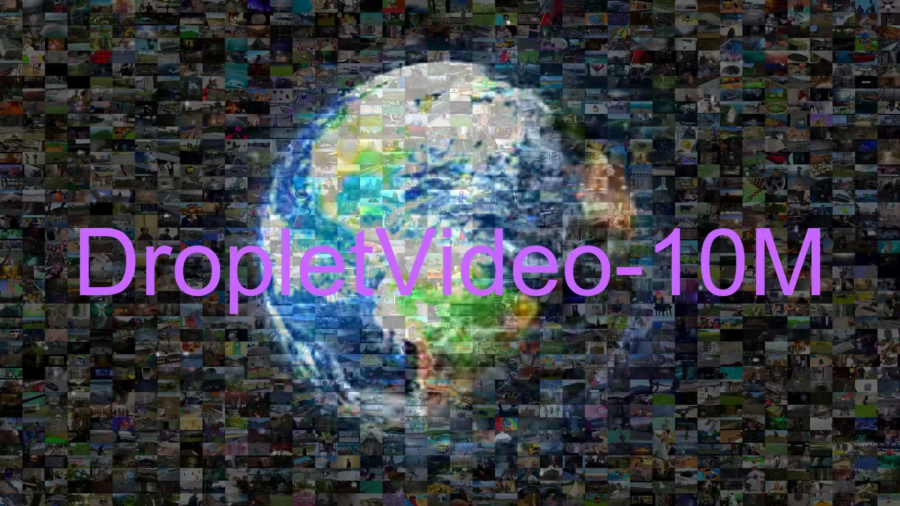

<p align="center">
  
</p>


### DropletVideo: A Dataset and Approach to Explore Integral Spatio-Temporal Consistent Video Generation

<p align="center">
  <a href="https://dropletx.github.io/"></a> &ensp;
  <a href="https://huggingface.co/papers/2503.06053"></a> &ensp;
  <a href="https://huggingface.co/datasets/DropletX/DropletVideo-10M"></a> &ensp;
  <a href="https://huggingface.co/datasets/DropletX/DropletVideo-1M"></a>
</p>

<p align="center">
  English | <a href="README_zh-CN.md">简体中文</a>
</p>


<br>


## ✈️ 介绍

**DropletVideo** 是一个探索图像到视频生成中高阶时空一致性的项目。该模型在 DropletVideo-10M 数据集上训练，支持多分辨率输入、动态 FPS 控制以调整运动强度，并展现出 3D 一致性的潜力。更多详情请查看我们的 [项目页面](https://dropletx.github.io/) 以及 [技术报告](https://arxiv.org/abs/2503.06053)。

## 🔥 特色

1. 支持多分辨率输入，可适配像素值范围从 512x512x85（默认 672x384x85）到 896x896x85（默认 1120x640x85），以及不同宽高比的视频。
2. 支持动态 FPS 控制以调整运动强度。

<br>

## 🚀 安装
**按照以下步骤设置项目环境。**

### 已测试的系统环境：

```
nvcc: NVIDIA (R) Cuda compiler driver
Copyright (c) 2005-2022 NVIDIA Corporation
Built on Wed_Sep_21_10:33:58_PDT_2022
Cuda compilation tools, release 11.8, V11.8.89
Build cuda_11.8.r11.8/compiler.31833905_0

NVIDIA A100-SXM4-80GB
Driver Version: 550.144.03
```

1. （可选）创建 Conda 环境并激活：

    ```bash
    conda create -n DropletVideo python=3.8
    conda activate DropletVideo
    ```

2. 安装所需依赖：

    ```bash
    cd DropletVideo_inference
    pip install -r requirements.txt
    ```

   我们提供了 `requirements.txt`，其中包含所有必要的依赖项，便于安装。

3. DropletVideo-5B 模型权重已上传至 [Huggingface](https://huggingface.co/DropletX/DropletVideo-5B)。

   模型内部权重的分布如下：

    - `text_encoder` 及 `tokenizer` 采用 Google T5 预训练模型权重（未训练）。
    - `scheduler` 负责推理时的去噪策略。
    - `vae` 是项目的像素到潜变量转换网络。
    - `transformer` 包含 5B 规模的 Transformer 模型权重。

    ```
    DropletVideo-V1.0-weights/
    ├── configuration.json
    ├── LICENSE
    ├── model_index.json
    ├── scheduler
    │     └── scheduler_config.json
    ├── text_encoder
    │     ├── config.json
    │     ├── model-00001-of-00002.safetensors
    │     ├── model-00002-of-00002.safetensors
    │     └── model.safetensors.index.json
    ├── tokenizer
    │     ├── added_tokens.json
    │     ├── special_tokens_map.json
    │     ├── spiece.model
    │     └── tokenizer_config.json
    ├── transformer
    │     ├── config.json
    │     └── diffusion_pytorch_model.safetensors
    └── vae
          ├── config.json
          └── diffusion_pytorch_model.safetensors
    ```

#### 说明：

   所有模型权重均采用 `safetensors` 格式存储。`safetensors` 是一种用于存储张量数据的文件格式，旨在提供高效、安全的读写操作，常用于存储机器学习模型的权重和参数。

   读取 `safetensors` 文件的方法如下：

   ```python
   from safetensors.torch import load_file
   state_dict = load_file(file_path)
   ```

<br>

## ⚡ 使用方法
安装完成后，可以使用以下命令运行示例：

```bash
python inference.py --ckpt DropletVideo-V1.0-weights --ref_img_dir your_path_to_ref_img --FPS 4 --prompt your_text_input
```

#### 示例：
```bash
python inference.py --ckpt DropletVideo-V1.0-weights --ref_img_dir assets/752.jpg --FPS 4 --prompt "视频展示了一座宏伟的音乐厅，中心是一架黑色的三角钢琴。整个场景优雅且富有艺术氛围。视频开始时，温暖的灯光照亮华丽的天花板，随后是一盏奢华的吊灯。这些吊灯呈环形排列，中心散发出柔和的白光。墙面装饰和雕刻精美，墙壁以金色和象牙白为主，营造出庄重而优雅的氛围。摄像机从钢琴的左后方移动至右侧，逐步揭示音乐厅的每个装饰细节，包括二楼的画廊、精美的拱形窗户以及面向观众席的空座位。随着镜头移动，钢琴的轮廓变得更加清晰，半开的琴盖下，光滑的黑白琴键在聚光灯下微微泛光。随着运动的继续，音乐厅的声学结构，如木地板和吸音墙逐渐展现，使空间更适合音乐演奏。视频最终定格在中心位置，展现整个大厅，钢琴与背景构成一幅美丽的艺术画面。"
```

### 命令行参数

#### 1. 必需参数
- `--ckpt`：模型权重的路径。
- `--ref_img_dir`：输入条件图像的路径。
- `--FPS`：控制运动强度的帧率。
- `--prompt`：输入文本。

#### 2. 其他参数
- `--width`：生成视频的宽度。
- `--height`：生成视频的高度。
- `--video_length`：生成视频的帧数。
- `--num_inference_steps`：推理时的去噪步数，通常值越高，视频质量越好，但计算成本也越高，默认设为 50。
- `--seed`：随机种子，不同的种子会生成不同的视频。
- `--guidance_scale`：去噪过程中的引导比例，值越高，生成视频与输入文本的匹配度越高。

#### 说明：
DropletVideo 可支持任意分辨率输入（当前版本未添加自动填充功能，输入的宽高必须是 16 的倍数）。默认 `width=672`、`height=384`、`video_length=85`，该设置可在单张 A100-40GB 显卡上运行。调试时可适当减少参数规模。

## 🙏 致谢
本项目借鉴了以下开源框架，感谢他们的贡献：

- [**CogVideoX-Fun**](https://github.com/aigc-apps/CogVideoX-Fun) - 训练策略
- [**CogVideoX**](https://github.com/THUDM/CogVideo) - VAE 压缩
- [**EasyAnimate**](https://github.com/aigc-apps/EasyAnimate) - I2V 模型配置
- [**Open-Sora-Plan**](https://github.com/PKU-YuanGroup/Open-Sora-Plan) - 数据处理
- [**Open-Sora**](https://github.com/hpcaitech/Open-Sora) - 额外控制

## 引用

🌟 如果您发现我们的工作有所帮助，欢迎引用我们的文章，留下宝贵的stars

```
@article{zhang2025dropletvideo,
        title={DropletVideo: A Dataset and Approach to Explore Integral Spatio-Temporal Consistent Video Generation},
        author={Zhang, Runze and Du, Guoguang and Li, Xiaochuan and Jia, Qi and Jin, Liang and Liu, Lu and Wang, Jingjing and Xu, Cong and Guo, Zhenhua and Zhao, Yaqian and Gong, Xiaoli and Li, Rengang and Fan, Baoyu},
        journal={arXiv preprint arXiv:2503.06053},
        year={2025}
      }
```


## ☎️ 联系我们
如果有任何问题或建议，请联系 [zrzsgsg@gmail.com](mailto:zrzsgsg@gmail.com)。

## 📄 许可证
本项目基于 [Apache 2.0 许可证](resources/LICENSE) 进行发布。

